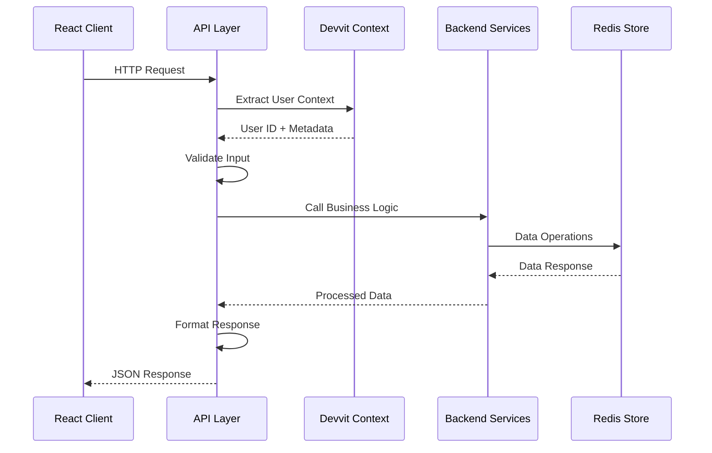

# Design Document

## Overview

Phase 3 implements the client-facing API layer that serves as the bridge between the React client application and the backend services. This design builds upon the established data layer (Phase 1) and seeding engine (Phase 2) to provide three core REST endpoints that power the Beef interactive post experience.

The API follows RESTful principles while optimizing for the specific needs of a collaborative daily voting game. It implements proper authentication via Devvit context, comprehensive input validation, rate limiting for abuse prevention, and structured error handling. The design prioritizes performance with sub-100ms response times and uses Redis pipelines for efficient data operations.

## Architecture

### API Endpoint Structure

The API follows Devvit Web conventions with clear namespace separation:

- **Client-facing endpoints**: `/api/*` - Called by the React client
- **Internal endpoints**: `/internal/*` - Used by scheduler and triggers (existing)

### Request/Response Flow



### Service Integration

The API layer integrates with existing services:

- **SeedingService**: Word generation and daily seed management
- **DataService**: Redis operations for choices, tallies, and seeds
- **IdentityService**: User ID hashing for privacy
- **TelemetryService**: Performance monitoring and metrics
- **PostDataService**: 2KB postData generation for initial state

## Components and Interfaces

### 1. API Router Module (`/api/router.ts`)

Central router that handles all client-facing endpoints with middleware for:
- JSON body parsing
- Request logging and telemetry
- Error handling and response formatting
- Rate limiting (for `/api/pick` only)

```typescript
interface APIRouter {
  setupRoutes(app: Express): void;
  handleInit(req: Request, res: Response): Promise<void>;
  handlePick(req: Request, res: Response): Promise<void>;
  handleProgress(req: Request, res: Response): Promise<void>;
}
```

### 2. Rate Limiting Service (`/services/rate-limit.service.ts`)

Redis-based rate limiting specifically for the `/api/pick` endpoint:
- 1 request per 3 seconds per user
- Uses hashed user ID as rate limit key
- TTL-based cleanup (5 second expiration)
- Returns 429 with Retry-After header

```typescript
interface RateLimitService {
  checkRateLimit(userHash: string): Promise<RateLimitResult>;
}

interface RateLimitResult {
  allowed: boolean;
  retryAfterSeconds?: number;
}
```

### 3. Input Validation Module (`/validation/api.validation.ts`)

Comprehensive input validation for all endpoints:
- Date format validation (YYYY-MM-DD)
- Word array validation (non-empty, string elements)
- Word count limits (max K words per submission)
- Type safety with TypeScript interfaces

```typescript
interface ValidationResult {
  isValid: boolean;
  errors: ValidationError[];
}

interface ValidationError {
  field: string;
  code: string;
  message: string;
}
```

### 4. Response Formatter (`/utils/response.formatter.ts`)

Standardized response formatting for consistency:
- Success responses with appropriate data structure
- Error responses with structured error codes
- HTTP status code mapping
- Response time logging

```typescript
interface APIResponse<T> {
  data?: T;
  error?: APIError;
  timestamp: number;
}

interface APIError {
  code: string;
  message: string;
  details?: Record<string, unknown>;
}
```

## Data Models

### Request/Response Types

```typescript
// GET /api/init response
interface InitResponse {
  seedPreview: string;        // First 8 chars of daily seed
  myWords: string[];          // User's generated word set
  progress: ProgressData;     // Current voting state
  timeLeftSec: number;        // Seconds until 23:00 Bangkok
}

// POST /api/pick request
interface PickRequest {
  words: string[];            // User's selected words
  date: string;               // YYYY-MM-DD format
}

// POST /api/pick response
interface PickResponse {
  ok: boolean;                // Operation success
  accepted: string[];         // Words that were accepted
  top: TallyEntry[];          // Updated top words
}

// GET /api/progress response
interface ProgressResponse {
  top: TallyEntry[];          // Current leaderboard
  my: string[];               // User's submitted choices
  timeLeftSec: number;        // Countdown to cutoff
}

// Shared progress data structure
interface ProgressData {
  top: TallyEntry[];          // Top N words with counts
  totalVotes: number;         // Total votes cast today
  uniqueVoters: number;       // Number of unique participants
}
```

### Error Response Structure

```typescript
interface ErrorResponse {
  error: {
    code: string;             // Machine-readable error code
    message: string;          // Human-readable message
    details?: {               // Optional additional context
      field?: string;         // Field that caused validation error
      expected?: string;      // Expected format/value
      received?: string;      // What was actually received
    };
  };
}

// Standard error codes
enum APIErrorCode {
  INVALID_DATE = 'INVALID_DATE',
  INVALID_WORDS = 'INVALID_WORDS',
  RATE_LIMITED = 'RATE_LIMITED',
  UNAUTHORIZED = 'UNAUTHORIZED',
  INTERNAL_ERROR = 'INTERNAL_ERROR',
  WORD_COUNT_EXCEEDED = 'WORD_COUNT_EXCEEDED',
  DUPLICATE_SUBMISSION = 'DUPLICATE_SUBMISSION'
}
```

## Error Handling

### Error Classification and Response Strategy

1. **Client Errors (4xx)**
   - Input validation failures → 400 Bad Request
   - Authentication issues → 401 Unauthorized  
   - Rate limiting → 429 Too Many Requests
   - Structured error responses with specific codes

2. **Server Errors (5xx)**
   - Service failures → 500 Internal Server Error
   - Redis connection issues → 503 Service Unavailable
   - Generic error messages (no internal details exposed)

3. **Error Logging Strategy**
   - Client errors: Log request details for debugging
   - Server errors: Log full stack trace and context
   - Never log raw user IDs (only hashed versions)
   - Include request ID for tracing

### Error Response Examples

```typescript
// Validation error
{
  "error": {
    "code": "INVALID_WORDS",
    "message": "One or more words are not from your generated word set",
    "details": {
      "field": "words",
      "invalid": ["invalidword1", "invalidword2"]
    }
  }
}

// Rate limit error
{
  "error": {
    "code": "RATE_LIMITED",
    "message": "Too many requests. Please wait before submitting again.",
    "details": {
      "retryAfterSeconds": 2
    }
  }
}
```

## Testing Strategy

### Unit Tests
- Input validation functions
- Response formatting utilities
- Rate limiting logic
- Error handling scenarios

### Integration Tests
- Full endpoint workflows with real Redis
- Authentication context handling
- Service integration points
- Performance benchmarks (sub-100ms targets)

### API Contract Tests
- Request/response schema validation
- Error response structure consistency
- HTTP status code correctness
- Rate limiting behavior verification

### Load Testing
- Concurrent user simulation
- Rate limiting under load
- Redis pipeline performance
- Memory usage patterns

## Performance Considerations

### Response Time Targets
- `/api/init`: < 100ms (includes word generation)
- `/api/pick`: < 50ms (Redis operations only)
- `/api/progress`: < 50ms (cached data retrieval)

### Optimization Strategies

1. **Redis Pipeline Usage**
   - Batch multiple Redis operations
   - Reduce network round trips
   - Atomic operations for consistency

2. **Data Caching**
   - Cache word pools and lexicon in memory
   - Cache daily seeds after first generation
   - Use Redis TTL for automatic cleanup

3. **Efficient Data Structures**
   - Sorted sets for top-N queries
   - Hashes for user choice storage
   - Strings for seed data (JSON serialized)

4. **Request Optimization**
   - Minimize service instantiation overhead
   - Reuse connections where possible
   - Lazy loading of non-critical data

## Security Considerations

### Authentication and Authorization
- User context extracted from Devvit middleware
- No manual token handling required
- User ID hashing for privacy protection

### Input Sanitization
- Strict type validation with TypeScript
- Word list validation against generated sets
- Date format enforcement
- Array length limits

### Rate Limiting
- Per-user rate limiting on write operations
- Redis-based tracking with TTL cleanup
- Exponential backoff recommendations

### Data Privacy
- User IDs always hashed before storage/logging
- No PII in error messages or logs
- Secure Redis key patterns

## Deployment and Configuration

### Environment Variables
- Existing variables from previous phases
- No additional configuration required
- Rate limiting parameters configurable via constants

### Monitoring and Observability
- Request/response logging via TelemetryService
- Performance metrics collection
- Error rate tracking
- Redis operation monitoring

### Health Checks
- Existing `/api/health` endpoint enhanced
- Service dependency checks
- Redis connectivity validation
- Response time monitoring

## Migration and Rollback

### Deployment Strategy
- Backward compatible with existing test endpoints
- Gradual rollout with feature flags
- A/B testing capability for performance tuning

### Rollback Plan
- Maintain existing test endpoints during transition
- Database schema unchanged (uses existing Redis patterns)
- Quick rollback via deployment revert

## Future Considerations

### Scalability
- Horizontal scaling via stateless design
- Redis clustering support
- CDN integration for static responses

### Feature Extensions
- WebSocket support for real-time updates
- Batch operations for multiple dates
- Advanced analytics endpoints
- Admin API for moderation tools

### Performance Monitoring
- APM integration
- Custom metrics dashboards
- Automated performance regression detection
- Capacity planning based on usage patterns